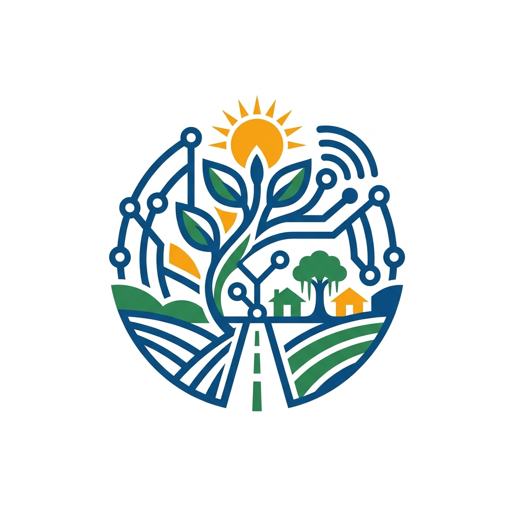
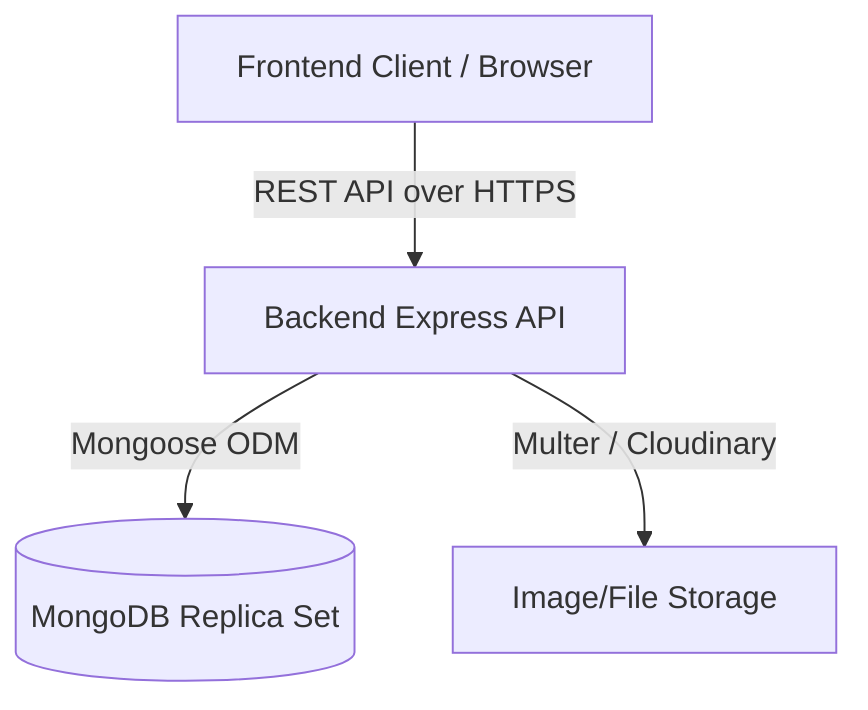

<div align="center">
  

  # Digital India Rural Empowerment Portal

  **Empowering Rural India through Digital Literacy, Connectivity, and Governance**

  [](https://reactjs.org/)
  [](https://vitejs.dev/)
  [](https://tailwindcss.com/)
  [](https://nodejs.org/)
  [](https://expressjs.com/)
  [](https://www.mongodb.com/)
  [](LICENSE)
</div>

---

## 4. Table of Contents

- [5. Project Overview](#5-project-overview)
- [6. Problem Statement](#6-problem-statement)
- [7. Vision & Objectives](#7-vision--objectives)
- [8. Key Features](#8-key-features)
- [9. Target Users](#9-target-users)
- [10. Use Cases](#10-use-cases)
- [11. Business Value](#11-business-value)
- [12. Screenshots](#12-screenshots)
- [13. Complete System Architecture](#13-complete-system-architecture)
- [14. High-Level Architecture Overview](#14-high-level-architecture-overview)
- [15. Application Workflow](#15-application-workflow)
- [16. End-to-End User Flow](#16-end-to-end-user-flow)
- [17. Technology Stack](#17-technology-stack)
- [18. Project Folder Structure](#18-project-folder-structure)
- [19. Explanation of Every Major Folder](#19-explanation-of-every-major-folder)
- [20. Explanation of Every Important File](#20-explanation-of-every-important-file)
- [21. Frontend Architecture](#21-frontend-architecture)
- [22. Backend Architecture](#22-backend-architecture)
- [23. Database Architecture](#23-database-architecture)
- [24. API Overview](#24-api-overview)
- [25. Authentication & Authorization](#25-authentication--authorization)
- [26. State Management](#26-state-management)
- [27. Storage Strategy](#27-storage-strategy)
- [28. Third-Party Services & Integrations](#28-third-party-services--integrations)
- [29. AI/Automation Components](#29-aiautomation-components)
- [30. Development Prerequisites](#30-development-prerequisites)
- [31. Installation Guide](#31-installation-guide)
- [32. Environment Variables](#32-environment-variables)
- [33. Project Configuration](#33-project-configuration)
- [34. Running the Project (Development)](#34-running-the-project-development)
- [35. Running the Project (Production)](#35-running-the-project-production)
- [36. Build Process](#36-build-process)
- [37. Deployment Guide](#37-deployment-guide)
- [38. CI/CD Overview](#38-cicd-overview)
- [39. Testing Strategy](#39-testing-strategy)
- [40. Debugging Tips](#40-debugging-tips)
- [41. Logging & Monitoring](#41-logging--monitoring)
- [42. Security Considerations](#42-security-considerations)
- [43. Performance Optimizations](#43-performance-optimizations)
- [44. Coding Standards & Conventions](#44-coding-standards--conventions)
- [45. Versioning Strategy](#45-versioning-strategy)
- [46. Branching Strategy](#46-branching-strategy)
- [47. Contribution Guidelines](#47-contribution-guidelines)
- [48. Release Process](#48-release-process)
- [49. Known Limitations](#49-known-limitations)
- [50. Future Roadmap](#50-future-roadmap)
- [51. Frequently Asked Questions (FAQ)](#51-frequently-asked-questions-faq)
- [52. Troubleshooting Guide](#52-troubleshooting-guide)
- [53. Changelog](#53-changelog)
- [54. License](#54-license)
- [55. Credits & Acknowledgements](#55-credits--acknowledgements)
- [56. Contact Information](#56-contact-information)
- [57. Final Project Summary](#57-final-project-summary)

---

## 5. Project Overview
The **Digital India Rural Empowerment Portal** is a production-grade, full-stack web application designed to bridge the digital divide in rural India. By consolidating access to government schemes, digital literacy programs, internet connectivity resources, and skill training, it serves as a unified digital ecosystem that empowers citizens, rural entrepreneurs, and local governance bodies.

## 6. Problem Statement
Rural communities in India often face significant barriers to accessing crucial government schemes, high-speed internet infrastructure (like BharatNet), and modern digital literacy training. Existing resources are heavily fragmented across various regional portals, making it difficult for the average rural citizen to stay informed, apply for benefits, and upskill themselves for the modern digital economy.

## 7. Vision & Objectives
**Vision:** To create a fully inclusive, digitally empowered rural India where every citizen has access to modern governance and digital services.
**Objectives:**
- Centralize access to key rural schemes (e.g., PMGDISHA, BharatNet).
- Provide a secure, localized, and easily navigable platform for citizens.
- Gamify and track digital literacy and skills training.
- Enable community internet infrastructure tracking.

## 8. Key Features
- **Government Scheme Directory:** Interactive, categorized database of active government schemes.
- **Digital Literacy Hub:** Trackable training courses with progress indicators.
- **Secure Authentication System:** Enterprise-grade JWT authentication with secure HTTP-only cookie support and local storage persistence.
- **Interactive User Profile:** Dynamic user dashboard featuring activity timelines, saved schemes, and enrolled courses.
- **Fully Responsive UI:** A pristine, Framer Motion-powered interface optimized for low-bandwidth mobile networks and desktop environments alike.

## 9. Target Users
1. **Rural Citizens:** Individuals looking to access government benefits, schemes, and fundamental digital literacy.
2. **Village Level Entrepreneurs (VLEs):** Operators of Common Service Centres (CSCs) facilitating digital services for citizens.
3. **Local Governance (Panchayats):** Authorities tracking internet infrastructure and scheme rollout within their jurisdiction.

## 10. Use Cases
- A farmer logging in to bookmark and track updates for a new agricultural subsidy.
- A student enrolling in the PMGDISHA digital literacy certification program.
- A rural entrepreneur finding information on how to deploy a PM-WANI Wi-Fi hotspot in their village.

## 11. Business Value
This platform reduces administrative overhead, increases scheme transparency, accelerates digital literacy adoption, and fosters a robust digital infrastructure at the grassroots level—aligning directly with the overarching goals of the Digital India initiative.

## 12. Screenshots
*(Placeholder for UI screenshots. Recommended: Home Page, User Dashboard, Government Schemes Directory, Login Modal)*
- ``
- ``

---

## 13. Complete System Architecture
The application leverages a classic **MERN stack** (MongoDB, Express, React, Node.js) separated into two distinct layers:
1. **Frontend Client (Vite + React)**
2. **Backend API (Node.js + Express)**

These layers communicate via RESTful JSON APIs secured by JSON Web Tokens (JWT).

## 14. High-Level Architecture Overview


## 15. Application Workflow
1. User requests a page; Vite serves the SPA (Single Page Application).
2. The `AuthContext` checks for an existing session via local storage and verifies it against the `/api/v1/auth/me` endpoint.
3. React Router DOM dynamically renders the requested view (e.g., User Profile, Schemes).
4. The client uses Axios interceptors to seamlessly attach JWTs to protected routes and handles 401s by forcing re-authentication.

## 16. End-to-End User Flow
`Landing Page` ➔ `Authentication (Login/Register)` ➔ `AuthContext Validates JWT` ➔ `User Redirected to Dashboard/Profile` ➔ `User Enrolls in Training / Bookmarks Scheme` ➔ `Backend Stores Data` ➔ `UI Optimistically Updates`.

---

## 17. Technology Stack
**Frontend:**
- React (v18.2) + Vite
- Tailwind CSS (v4)
- Framer Motion (Animations)
- React Router DOM (Routing)
- Axios (HTTP Client)
- React Hook Form (Form Validation)
- Lucide React (Icons)

**Backend:**
- Node.js + Express.js
- MongoDB + Mongoose (Database & ODM)
- JSON Web Tokens (Auth)
- Bcryptjs (Password Hashing)
- Helmet + Express Rate Limit + Mongo Sanitize (Security)
- Multer (File Uploads)

---

## 18. Project Folder Structure
```text
Rural_empowerment/
├── backend/                  # Node.js / Express Backend
│   ├── config/               # DB and env configs
│   ├── controllers/          # Route logic
│   ├── middlewares/          # Auth, Error handling, Security
│   ├── models/               # Mongoose Schemas
│   ├── routes/               # API endpoint definitions
│   ├── utils/                # Helper classes (ApiError, ApiResponse)
│   ├── validators/           # Express-validator schemas
│   ├── server.js             # Entry point
│   └── app.js                # Express app setup
│
├── digital-india-rural-portal/ # React / Vite Frontend
│   ├── public/               # Static assets (logo.png)
│   ├── src/
│   │   ├── components/       # Reusable UI components
│   │   ├── context/          # React Context (AuthContext)
│   │   ├── hooks/            # Custom hooks
│   │   ├── pages/            # View components (Profile, Login)
│   │   ├── services/         # Axios API wrappers
│   │   ├── App.jsx           # Main React component
│   │   └── main.jsx          # React DOM render entry
│   ├── index.html
│   └── vite.config.js
└── README.md
```

## 19. Explanation of Every Major Folder
- `backend/controllers`: Contains the business logic for every endpoint to keep routing logic clean.
- `backend/middlewares`: Handles global error catching, JWT verification (`auth.middleware`), and security layers.
- `backend/models`: Database architecture schemas (e.g., `User.js`, `Scheme.js`).
- `digital-india-rural-portal/src/components`: Divided by feature (e.g., `auth/`, `layout/`, `navbar/`, `profile/`).
- `digital-india-rural-portal/src/services`: Abstracts all Axios requests (`authService.js`, `userService.js`) allowing components to remain agnostic of the HTTP client.

## 20. Explanation of Every Important File
- `backend/app.js`: Configures the Express application, injecting CORS, Helmet, Rate Limiting, and mounting API routers.
- `backend/server.js`: Connects to MongoDB and starts the HTTP server.
- `digital-india-rural-portal/src/services/axiosConfig.js`: Configures global Axios interceptors for injecting authorization headers and handling 401 token expirations globally.
- `digital-india-rural-portal/src/context/AuthContext.jsx`: Manages global user state, persistent logins, and profile syncing.

---

## 21. Frontend Architecture
The frontend employs a **Component-Driven Architecture**. State that applies globally (Authentication, UI Theme) resides in Context API. Page-specific state is managed locally via hooks (`useState`, `useEffect`). Data fetching is strictly segregated into the `services/` directory to enforce the separation of concerns.

## 22. Backend Architecture
The backend uses a strict **Controller-Service-Model** pattern. Requests enter through `app.js`, hit standard `routes/`, are validated by `validators/`, processed by `controllers/`, which interact with `models/`. Responses are universally formatted using the custom `ApiResponse` wrapper.

## 23. Database Architecture
MongoDB is utilized as the primary datastore.
- **User Collection:** Stores authentication data, personal info, and arrays of object references to enrolled courses and bookmarked schemes.
- **Scheme Collection:** Stores rich metadata regarding active government schemes.
- **Internet Collection:** Tracks broadband/infrastructure availability by geographic regions.

## 24. API Overview
All APIs are prefixed with `/api/v1/`.
- `POST /auth/register`, `POST /auth/login`: Authentication.
- `GET /auth/me`: Verifies and retrieves current session.
- `GET /users/profile`: Retrieves protected profile details.
- `PUT /users/profile`: Updates user metadata.

## 25. Authentication & Authorization
Employs JWT-based authentication. 
- Upon successful login, the backend issues an Access Token.
- The React client stores this token in `localStorage` and injects it into every subsequent request via the Axios Request Interceptor.
- If a token expires, the Axios Response Interceptor catches the `401 Unauthorized` backend response, clears local storage, and seamlessly redirects the user to the login screen.

## 26. State Management
React's **Context API** (`AuthContext`) handles all global authentication state. Local component state manages form inputs and UI toggles (e.g., dropdowns, modals).

## 27. Storage Strategy
- **Relational/Document Data:** MongoDB (Atlas / Local).
- **Static Assets:** Hosted via Vite's `public/` folder.
- **User Uploads (Images):** Handled via `multer` in the backend (currently stored in local `/uploads` directory, scalable to Cloudinary/AWS S3).

## 28. Third-Party Services & Integrations
- *(Planned)* SMS Gateways for OTP verification.
- *(Planned)* Cloudinary for persistent profile image hosting.

## 29. AI/Automation Components
- *(Not currently implemented in Phase 1).*

---

## 30. Development Prerequisites
- **Node.js**: v18.0.0 or higher.
- **MongoDB**: Local instance running on port 27017 or a valid MongoDB Atlas URI.
- **NPM / Yarn**: Package managers.

## 31. Installation Guide
```bash
# 1. Clone the repository
git clone <repo-url>
cd Rural_empowerment

# 2. Install backend dependencies
cd backend
npm install

# 3. Install frontend dependencies
cd ../digital-india-rural-portal
npm install
```

## 32. Environment Variables
### Backend (`backend/.env`)
```env
PORT=5000
NODE_ENV=development
MONGO_URI=mongodb://127.0.0.1:27017/rural_empowerment
JWT_SECRET=super_secret_jwt_key_for_rural_portal_2026
JWT_EXPIRE=30d
CORS_ORIGIN=http://localhost:5173
```

### Frontend (`digital-india-rural-portal/.env`)
```env
VITE_API_URL=http://localhost:5000/api/v1
```

## 33. Project Configuration
- Backend utilizes `dotenv` for configuration injection.
- Frontend uses Vite's built-in `import.meta.env` injection.

## 34. Running the Project (Development)
Open two terminal windows:
**Terminal 1 (Backend):**
```bash
cd backend
npm run dev
```
**Terminal 2 (Frontend):**
```bash
cd digital-india-rural-portal
npm run dev
```

## 35. Running the Project (Production)
**Backend:**
```bash
cd backend
npm run start
```
**Frontend:**
```bash
cd digital-india-rural-portal
npm run build
# Serve the resulting /dist folder using Nginx, Apache, or serve
```

## 36. Build Process
Vite optimizes the frontend using Rollup. Running `npm run build` generates heavily minified, chunked, and optimized static assets inside the `dist` directory, fully resolving CSS and JS trees.

## 37. Deployment Guide
- **Frontend:** Can be deployed as a static site to Vercel, Netlify, or AWS S3/CloudFront.
- **Backend:** Can be deployed to Heroku, Render, AWS EC2, or Google Cloud Run. Ensure `NODE_ENV=production` is set.
- **Database:** MongoDB Atlas is recommended for production.

## 38. CI/CD Overview
*(To be implemented via GitHub Actions: Automated linting, testing, and deployment to staging environments upon merge to `main`).*

## 39. Testing Strategy
*(Currently pending implementation).*
- **Frontend:** Vitest + React Testing Library (Component Unit Tests).
- **Backend:** Jest + Supertest (API Endpoint Integration Tests).

## 40. Debugging Tips
- If the frontend rapidly loops to the login page, verify that the `JWT_SECRET` matches across environments, or clear local storage.
- If the backend reports `ECONNREFUSED 127.0.0.1:27017`, ensure the MongoDB local service is running.

## 41. Logging & Monitoring
- In development, the backend uses `morgan` for detailed HTTP request logging.
- Advanced logging is centralized using custom Winston loggers (`utils/logger.js`).

## 42. Security Considerations
- **Helmet:** Sets secure HTTP headers.
- **Express-Rate-Limit:** Prevents brute force and DDoS attacks.
- **Express-Mongo-Sanitize & XSS-Clean:** Prevents NoSQL injections and cross-site scripting payload execution.
- **Bcrypt:** Ensures passwords are mathematically unrecoverable.

## 43. Performance Optimizations
- **Compression:** Backend uses `compression` middleware to gzip JSON payloads.
- **Lazy Loading:** Frontend component code-splitting via Vite and React.
- **Debouncing:** API requests from search fields are debounced to reduce server load.

## 44. Coding Standards & Conventions
- **ES6+ Syntax:** Arrow functions, destructuring, and async/await everywhere.
- **Folder Structure:** Modular components (Feature-based grouping in frontend).
- **Naming Conventions:** PascalCase for React components, camelCase for variables/functions.

## 45. Versioning Strategy
Semantic Versioning (SemVer) is followed: `MAJOR.MINOR.PATCH` (e.g., `v1.0.0`).

## 46. Branching Strategy
Git Flow:
- `main` - Production stable.
- `develop` - Active development branch.
- `feature/*` - Individual new features.
- `bugfix/*` - Hotfixes.

## 47. Contribution Guidelines
1. Fork the repository.
2. Create your feature branch (`git checkout -b feature/AmazingFeature`).
3. Commit your changes (`git commit -m 'Add some AmazingFeature'`).
4. Push to the branch (`git push origin feature/AmazingFeature`).
5. Open a Pull Request.

## 48. Release Process
1. Finalize PRs into `develop`.
2. Draft release notes.
3. Merge `develop` into `main`.
4. Tag release on GitHub.

## 49. Known Limitations
- Current file upload strategy relies on local disk storage (`/uploads`), which is not suitable for ephemeral serverless deployment environments. Migration to an S3-compatible service is required for horizontal scaling.
- Mock data is currently returned for `trainings`, `activity`, and `bookmarks` endpoints.

## 50. Future Roadmap
- **Phase 2:** Implement Admin Dashboard for Scheme Management.
- **Phase 3:** Integrate Regional Language Support (i18n).
- **Phase 4:** Cloudinary integration for image uploads.

## 51. Frequently Asked Questions (FAQ)
**Q: The frontend says "Unauthorized" immediately after logging in?**
A: Check your browser's local storage to ensure `token` is being saved properly. If using `localhost`, ensure your backend CORS policy explicitly allows your frontend's port.

## 52. Troubleshooting Guide
- **MongoDB Connection Errors:** Verify your `MONGO_URI` uses `127.0.0.1` instead of `localhost` on newer Node.js versions due to IPv6 resolution issues.

## 53. Changelog
- **[v1.0.0] - Initial Release:** Built full authentication flow, custom protected routes, dynamic user avatar generation, and integrated profile dropdown with Framer Motion.

## 54. License
This project is licensed under the MIT License - see the LICENSE file for details.

## 55. Credits & Acknowledgements
- Designed and architecture supported by [Digital India Initiatives].
- UI inspired by modern enterprise government portals.
- Icons provided by [Lucide React].

## 56. Contact Information
For support or contribution queries, please open an issue in the repository.

## 57. Final Project Summary
The Digital India Rural Empowerment Portal stands as a highly secure, modern, and scalable solution tailored to bring essential governance, internet access information, and digital literacy resources directly to rural communities, utilizing cutting-edge web technologies to ensure speed, accessibility, and reliability.
